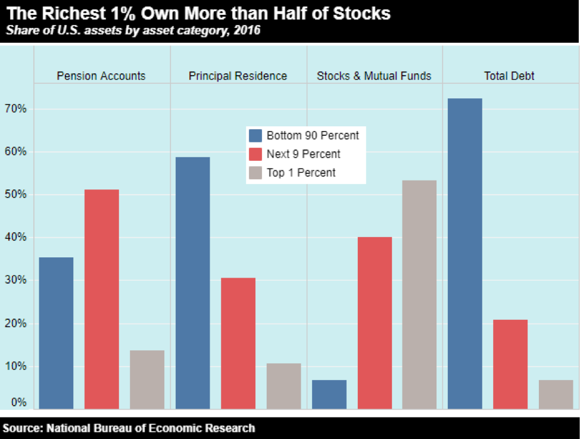
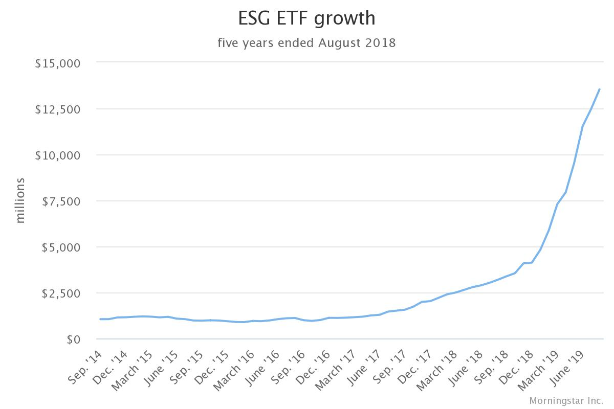

## STASH INVEST ##
*The Revoluion Is Real!*

## OVERVIEW ## 
 ##### STASH FINANCIAL, INC dba STASH INVEST was founded on Feb 19th, 2015 by Brandon Krieg and Eddie Robinson.

 ## THE IDEA ##
 ##### 	How did the idea for the company come about? Both co-founders Brandon Krieg and Eddie Robinson worked together at Macquarie (Australian Investment Bank).  After a few years working together running the electronic trading platform from the bank, they both independently fielded questions from family and friends that were not in finance about which stocks to buy and when to sell, questions about money and the overall financial markets.  Essentially, these people did not have anyone to turn to, as Brandon stated, they became obsessed with the idea and both resigned within a few weeks to start a new company.  According to a Forbes article, they spent months asking people on the street about money, investing and saving.  The questions were simple, "do you invest, and do you save?" and almost every single time, they would hear the same thing, “No, I don’t invest but really want to.  I just don’t understand it.  It’s really confusing to me, so I’ll do it later.  That was the key phrase for the dynamic duo, the majority of every day Americans are not financially literate, and they wanted to solve this problem.  The great bull market started shortly after the financial crisis and the S&P 500 index is up over 100% since it's lows in 2008.  In addition, most have not or were unable to particiapte in most of this upside, financial literacy, too much debt, cost to entry, are just a few reasons why Stash Invest positioned themselves to help.  Moreoever, the explosion for passive trading vehicles in the form of exhcange traded products (ETF's) and the ability to trade these products in fractional shares, has now allowed investing to be ejoyed by all income levels.  

 ## FUNDING ##
 ##### How is the company funded? How much funding have they received? Stash has raised a total of $189.3M in funding over 7 rounds.  Their latest funding was raised on March 12, 2019 from a Series E round.  https://www.crunchbase.com/organization/stash-5#section-funding-rounds

## BUSINESS ACTIVITIES ##
##### Stash provides its clients access to financial opportunity by allowing micro-investing.  Essentially for as little as $5 per month, customers have access to a broad range of investment and banking products. Stash helps to bridge the wealth gap through financial literacy. They are a mission driven company not only to do well but to do good which has attracted millions of clients throughout the United States.  The intended customer are really "The Forgotten" or people that feel that they do not have the means or the education to invest.  According to the National Bureau of Economic Research, the top 10% of Richest American own more than 92% of Stocks and Mutual Funds (Graph Below)

##### While Stash Invest started off in it's early days as a Robo Advisor, they have evolved into a much braoder financial services firm.  Currently they offer clients access to Investments, Banking, Retirement, and Custodial accounts.  

##### Stash has carved a unique thematic approach to investing made easy.  Customers can log into their account and and pick a list of thematic ETF's of which examples include; "Corporate Cannabis", "Data Defenders", "Delicious Dividends" "Combat Carbon", etc. Stash has continually been involved with growing asset clases that traditional asset management firms invest and repackage to the their client base.  Social investing as an example has been on of most rapid growing investing themes since 2015, almost $15 Billion dollars have been invested in ESG (Enviornmental, Social, and Goverance) products.  

##### In addition, Stash offers its clients a very unique rewards program called "Stockback".  Essentially, when you use your banking / debit card at any one of your favorite stores are restaurants, you will automatically get shares or stock back into your account.  So a customer that loves eating at Chipotle and shopping at target and will receive stock back rewards onto their account.  This is turn helps Stash's customers be part of investing community that they did not have access to before.  

