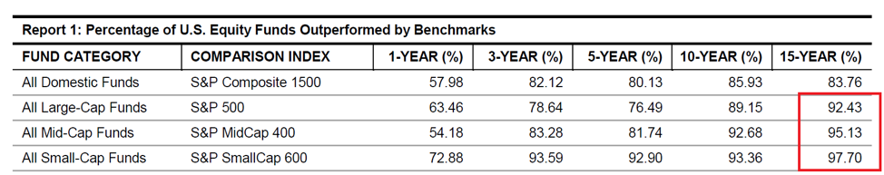
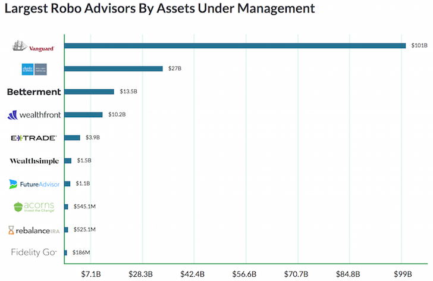
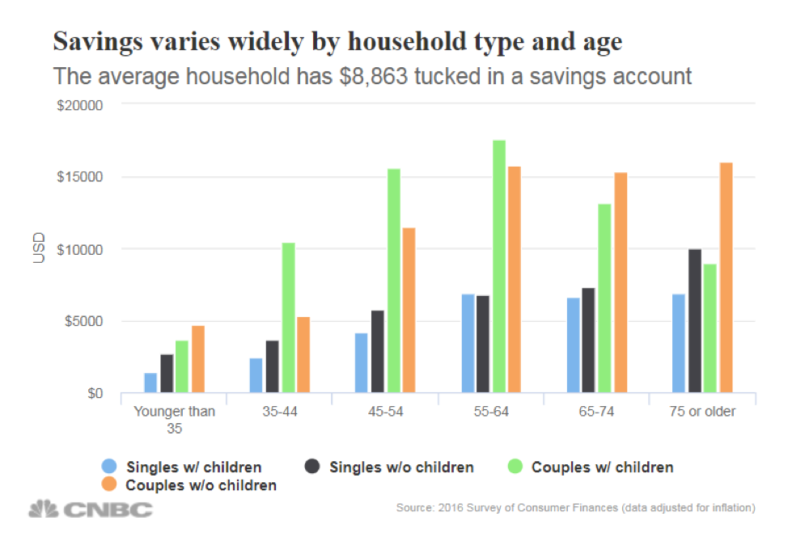

## STASH INVEST -*Revolutionizing access to financial markets for the average American!*

## *OVERVIEW* ## 
 ##### STASH FINANCIAL, INC dba STASH INVEST was founded on Feb 19th, 2015 by Brandon Krieg and Eddie Robinson.

 ## *THE IDEA* ##
 ##### 	How did the idea for the company come about? Both co-founders Brandon Krieg and Eddie Robinson worked together at Macquarie (Australian Investment Bank).  After a few years working together running the electronic trading platform from the bank, they both independently fielded questions from family and friends that were not in finance about which stocks to buy and when to sell, questions about money and the overall financial markets.  Essentially, these people did not have anyone to turn to, as Brandon stated, they became obsessed with the idea and both resigned within a few weeks to start a new company.  According to a Forbes article, they spent months asking people on the street about money, investing and saving.  The questions were simple, "do you invest, and do you save?" and almost every single time, they would hear the same thing, “No, I don’t invest but really want to.  I just don’t understand it.  It’s really confusing to me, so I’ll do it later.  That was the key phrase for the dynamic duo, the majority of every day Americans are not financially literate, and they wanted to solve this problem.  The great bull market started shortly after the financial crisis and the S&P 500 index is up over 100% since it's lows in 2008.  In addition, most have not or were unable to participate in most of this upside, financial literacy, too much debt, cost to entry, are just a few reasons why Stash Invest positioned themselves to help.  Moreover, the explosion for passive trading vehicles in the form of exchange traded products (ETF's) and the ability to trade these products in fractional shares, has now allowed investing to be enjoyed by all income levels.  

 ## *FUNDING* ##
 ##### How is the company funded? How much funding have they received? Stash has raised a total of $189.3M in funding over 7 rounds.  Their latest funding was raised on March 12, 2019 from a Series E round.  https://www.crunchbase.com/organization/stash-5#section-funding-rounds

## *BUSINESS ACTIVITIES* ##
##### Stash provides its clients access to financial opportunity by allowing micro-investing.  Essentially for as little as $5 per month, customers have access to a broad range of investment and banking products. Stash helps to bridge the wealth gap through financial literacy. They are a mission driven company not only to do well but to do good which has attracted millions of clients throughout the United States.  The intended customers are really "The Forgotten" or people that feel that they do not have the means or the education to invest.  According to the National Bureau of Economic Research, the top 10% of Richest American own more than 92% of Stocks and Mutual Funds (Graph Below)

##### While Stash Invest started off in its early days as a Robo Advisor, they have evolved into a much broader financial services firm.  Currently they offer clients access to Investments, Banking, Retirement, and Custodial accounts.  

##### Stash has carved a unique thematic approach to investing made easy.  Customers can log into their account and and pick a list of thematic ETF's of which examples include; "Corporate Cannabis", "Data Defenders", "Delicious Dividends" "Combat Carbon", etc. Stash has continually been involved with growing asset classes that traditional asset management firms invest and repackage to the their client base.  Social investing as an example has been on of most rapid growing investing themes since 2015, almost $15 Billion dollars have been invested in ESG (Enviromental, Social, and Governance) products.  

##### In addition, Stash offers its clients a very unique rewards program called "Stockback".  Essentially, when you use  banking / debit card at any one of your favorite stores are restaurants, you will automatically get shares or stock back into your account.  So a customer that loves eating at Chipotle and shopping at target and will receive stock back rewards onto their account.  This is turn helps Stash's customers be part of investing community that they did not have access to before.  According to a survey by Investopedia, most of the respondents suggest that of the money saved 24% and 20% are allocated into checking and savings accounts which produce lower returns than core inflation. 

##### Stash allows its clients to invest, bank, set up retirement accounts, and accounts for kids all on one uniquely integrated digital platform.  Stash utilizes a number of technologies ranging from over 42 unique development and data apps, 13 utilities, and over 20 dev ops. https://stackshare.io/stash/stash#team.  These technologies are used for the development and execution of their products, learning sites, and Stockback rewards programs.  

## *THE LANDSCAPE* ##
##### While Robo Advisors and Digital Banks have been around for the past 10 years formed out of the ashes of the financial crisis, the technology has dramatically revolutionized the way financial advice is captured.  According to research done by Lusarid and Mitchell (2014), the majority of the population, both in the United States and elsewhere, lacks basic financial literacy.  The portfolios of robo-advisors started off as mainly exchange traded funds, today, robo-advisors have branched into a much broader offering of ETF's, single stocks, portfolio rebalancing, tax-loss harvesting, etc.

##### The significant growth of robo advisory has been attributed to the gap in low-and-middle class investors who are under advised or are unable to obtain basic financial planning because of the cost to entry.  The average financial advisor has over $50,000 and with fee's starting at 1.45% (Advisory HQ)  The starting cost to entry is much lower than that for robo advisors.  You can start with $1 a month using Stash Invest.  One of the hidden sins of active management is their continual lack of underperformance compared to the overall market.  According to research report by the Standard & Poors company, over the last 15 years,92.3% of large cap funds lagged their benchmark and 95.4% and 93.2% Mid and Small Cap funds lagged their benchmarks.  

 ## *RESULTS* ##
 
 ##### Stash is situated in a highly competitive domain.  Other companies such as Vanguard, Schwab, Wealthfront, Betterment, Personal Capital, and Robinhood all have relevant footprints and unique product offerings to their perspective customer bases. However, there is no arguing that Stash has quickly accelerated into a differentiated competitor combining both the robo-advising and digital banking and leading the charge in developing better and more efficient technologies.

 ##### * $1.88 Billion have been "Stashed Away"
 ##### * 4 Million Users and growing
 ##### * 86% of Stashers are first time investors
 ##### * $5 Million in Stock Back Rewards earned

##### While financial results are always key to how a company is doing.  For start-ups and late stage companies such as Stash, their value is determined by a combination of growth (User Base) and Assets Under Management (AUM) and Banking deposits.  While some of these stats have been reported by Stash invest, the other financial variables remain confident in their assessement utilizing Stock Back Rewards and the number of users, and funding commitments all suggest Stash is disrupting and educating as their leaders set out to do.  Below is a chart made from the financial samurai website that lists robo-advisors AUM, Stash would be in the top 10 measuring by reported Assets.  

##### The robo-advisor segment has witnessed a profound transformation over the last 10 years.  Estimates for 2025 say that Robo-advisors will manage $2.1T - $4.2T which would be up from approximately $400B today.  Robo-advisors account for roughly .44% ~ .63% of the total $80T in global assets.  Stash has the potential to be continued disruptor in this segment by committed to their current goal of financial literacy, innovate products, and differentiation.  Combined, with a strong commitment to its people and leadership can have Stash Invest listed on the public markets within the next 5 years.  The average household has $8,863 saved in a savings account, the current rate of return for a savings account is less than inflation, so in order to be better prepped for retirement and retire at a reasonable age, we must become better educated and diciplined in our savings, placements, and investments.  

## *RECOMMENDATIONS* ##

##### Stash is on the right track about the need for financial literacy.  The market is ripe and financial investing should not be enjoyed only by the upper-class.  The growth is here to stay and in order to remain relevant, in addition, to the continued commitment to financial education, Stash has the ability to compete and innovate on many different products including "Debt Back" a way to help pay down current Stash member student loans.  They can also help to expand into the college for savings 529 Plans which can help those afford or offset the ever-growing costs of college.  Lastly, Stash can take the current model they have here in the United States and expand that into different developed parts of the world.  

##### In closing, the rise of Robo-advisors and Digital banking will continue to evolve, ensuring that you do not become complacent is paramount into a company's success.  I believe Stash Invest will be a company we will continute to hear about in the next ten years and beyond. 

## *CITED SOURCES* ##
##### www.stashinvest.com 

##### https://learn.stashinvest.com/

##### https://www.stashinvest.com/newsroom

##### www.personalcapital.com, www.robinhood.com, www.capital.com

##### https://learn.stashinvest.com/ep-054-stash

##### https://www.crunchbase.com/organization/stash-5#section-funding-rounds

##### www.stashinvest.com

##### https://www.businessinsider.com/stash-brandon-krieg-interview-investing-stock-market-2017-7

##### https://www.stashinvest.com/newsroom

##### www.personalcapital.com www.robinhood.com www.capital.com

##### https://en.wikipedia.org/wiki/Robo-advisor

##### https://en.wikipedia.org/wiki/Digital_banking

##### https://www.investopedia.com/robo-advisors-2019-where-have-all-the-assets-gone-4767826

##### https://www.investopedia.com/study-affluent-millennials-are-warming-up-to-robo-advisors-4770577

##### https://gflec.org/wp-content/uploads/2014/12/economic-importance-financial-literacy-theory-evidence.pdf 

##### https://www.marketwatch.com/story/why-way-fewer-actively-managed-funds-beat-the-sp-than-we-thought-2017-04-24 

##### https://www.statista.com/statistics/573291/aum-of-selected-robo-advisors-globally/  

##### https://www.advisoryhq.com/articles/financial-advisor-fees-wealth-managers-planners-and-fee-only-advisors/